<p align="center">
  
</p>

<p align="center">
  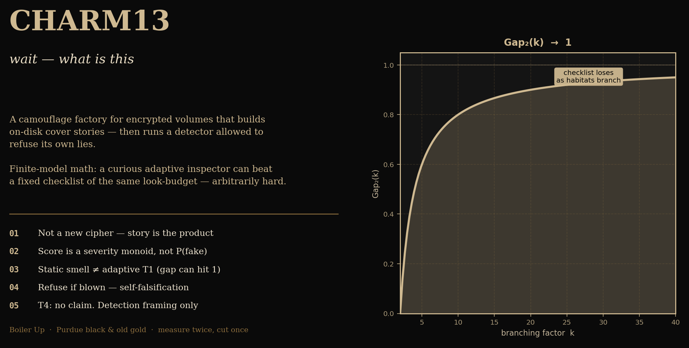
</p>

<p align="center"><em>
Notes on budgeted adaptive inspection in finite models.<br/>
Exact envelopes, matching constructions, and certificates.<br/>
An engineering application is recorded after the mathematics.
</em></p>

---

## Preface

These notes develop the comparison between **adaptive** and **nonadaptive** observation under a fixed look budget $B$, measured in total variation of transcript laws. The ambient setting is finite. Queries are maps $q\colon W\to Y_q$. Unless otherwise stated they are *open*: globally addressable, of unit cost, and non-destructive.

The principal quantity is the worst-case additive gap at budget two under active arity at most $K$:

$$
G_2(K)=\sup\bigl(D_2^{\mathrm{ad}}-D_2^{\mathrm{na}}\bigr)=1-\frac1K.
$$

The identity is proved inside the frozen model below and is attained by an explicit construction. Whether the package is new relative to the broader literature on sequential testing and costly feature acquisition is left open; the abstract existence of adaptive gains is classical. What is collected here is a closed finite theory: flattening, root-arity, equality classification of the binary extremizer, habitat-shaped closed forms, exact rational certificates, and the consequences for a static detection checklist used as engineering quality control.

We do not claim laboratory (T4) hardness, a new cipher, or a probabilistic interpretation of severity scores.

**Contents of the mathematical part.**  
[`research/THEOREMS.md`](research/THEOREMS.md) (catalog) · [`research/m5/SEED_THEOREMS.md`](research/m5/SEED_THEOREMS.md) (proofs) · [`research/LADDER_MASTER.md`](research/LADDER_MASTER.md) (missions M4–M18).

---

## §1. Notation

Let $W$ be a finite set of worlds and let $P,Q$ be probability distributions on $W$. Write $\mu=P-Q$ for the signed mass and

$$
r=\bigl|\\{w:\mu(w)\ne 0\\}\bigr|
$$

for the size of the active support. A *policy of budget $B$* is either adaptive (a decision tree of depth at most $B$) or nonadaptive (a fixed collection of at most $B$ queries). The quantities $D_B^{\mathrm{ad}}(P,Q)$ and $D_B^{\mathrm{na}}(P,Q)$ are the respective maximal transcript total variations.

---

## §2. Principal results (OPEN model)

### Theorem (Flattening).

If $r\le B+1$, then

$$
D_B^{\mathrm{ad}}(P,Q)=D_B^{\mathrm{na}}(P,Q).
$$

In particular, a strict adaptivity gap at budget two requires at least four active worlds.

### Theorem (Root-arity and sharp gap).

If every query has active arity at most $K$, then

$$
D_2^{\mathrm{ad}}\le K\\,D_2^{\mathrm{na}},
\qquad
D_2^{\mathrm{ad}}-D_2^{\mathrm{na}}\le 1-\frac1K.
$$

Both bounds are sharp: there exists a finite system with $D_2^{\mathrm{ad}}=1$ and $D_2^{\mathrm{na}}=1/K$. Consequently

$$
\boxed{G_2(K)=1-\dfrac{1}{K}.}
$$

### Theorem (Binary extremizer).

For $K=2$ the additive gap is at most $1/2$. Among four-world, binary, OPEN systems attaining the bound, the extremal geometry is unique up to the natural symmetries and coincides with the four-world *butterfly* recorded in the M4/M5 notes.

### Remark (Priority).

The sharp seed package is proved in the frozen model. Its literature priority is unresolved. Residual contributions emphasized here are support flattening, the exact root-arity envelope, equality classification, habitat closed forms, and the engineering corollaries in §6.

<p align="center">
  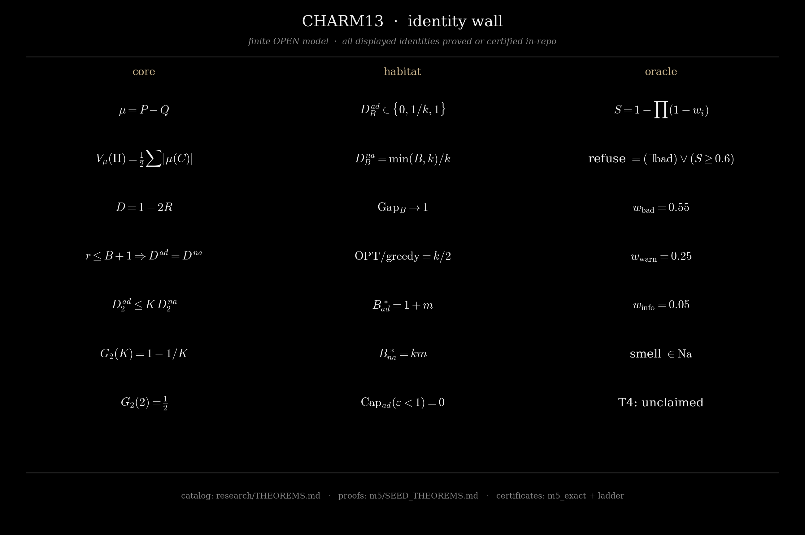
</p>

<p align="center">
  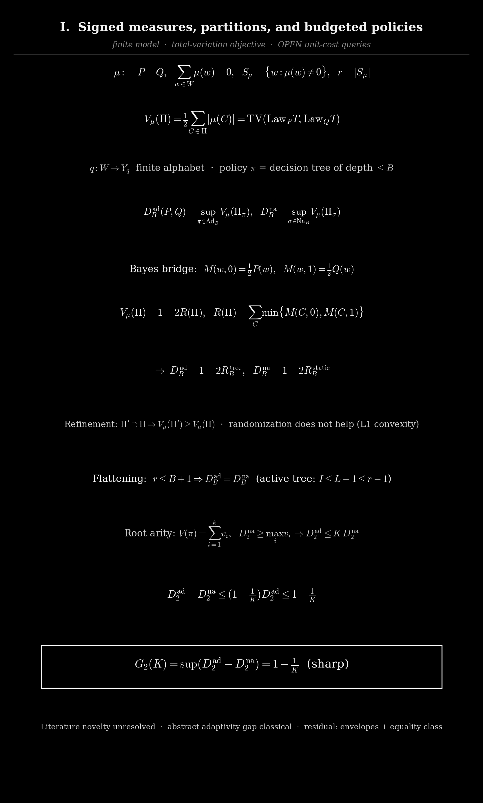
</p>

<p align="center">
  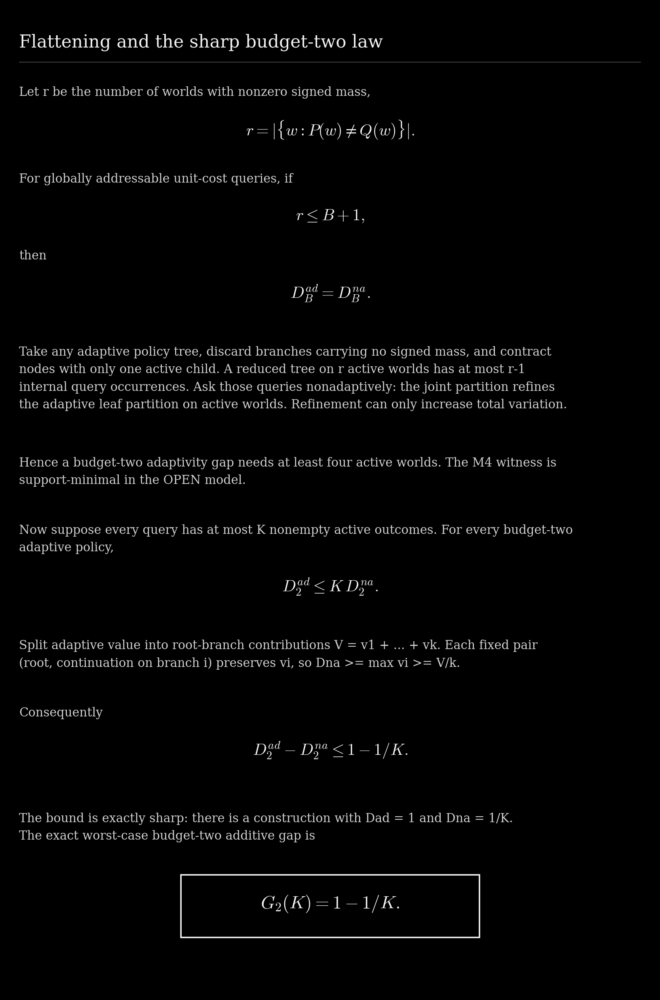
</p>

<p align="center">
  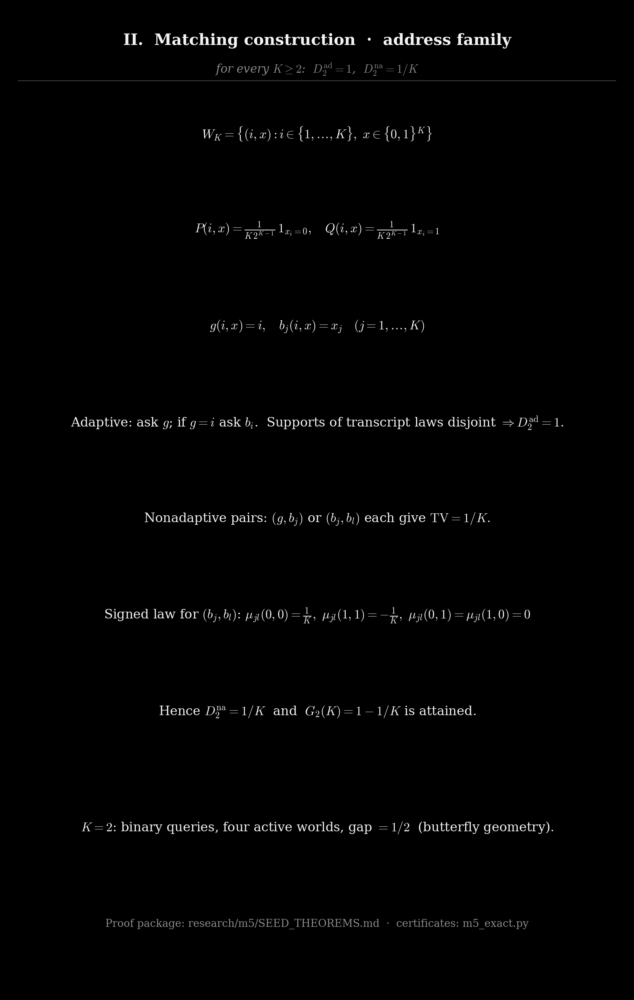
</p>

<p align="center">
  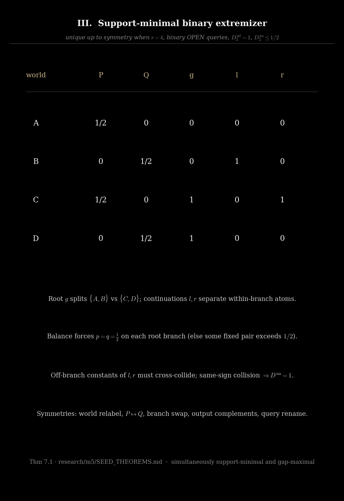
</p>

<p align="center">
  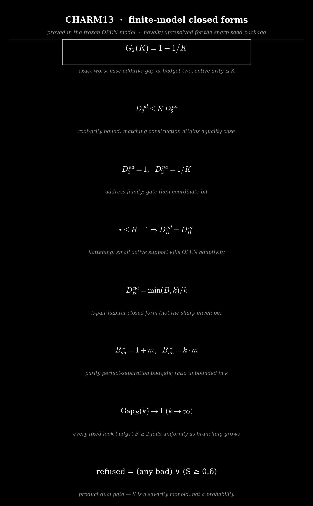
</p>

<p align="center">
  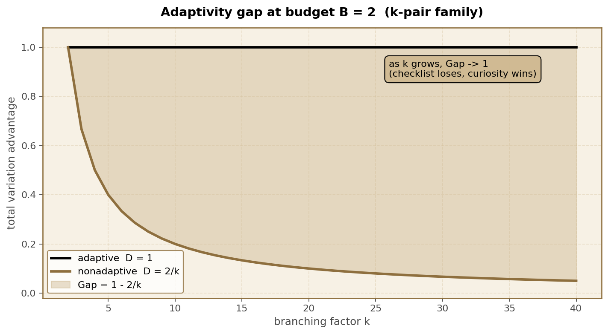
</p>

<p align="center">
  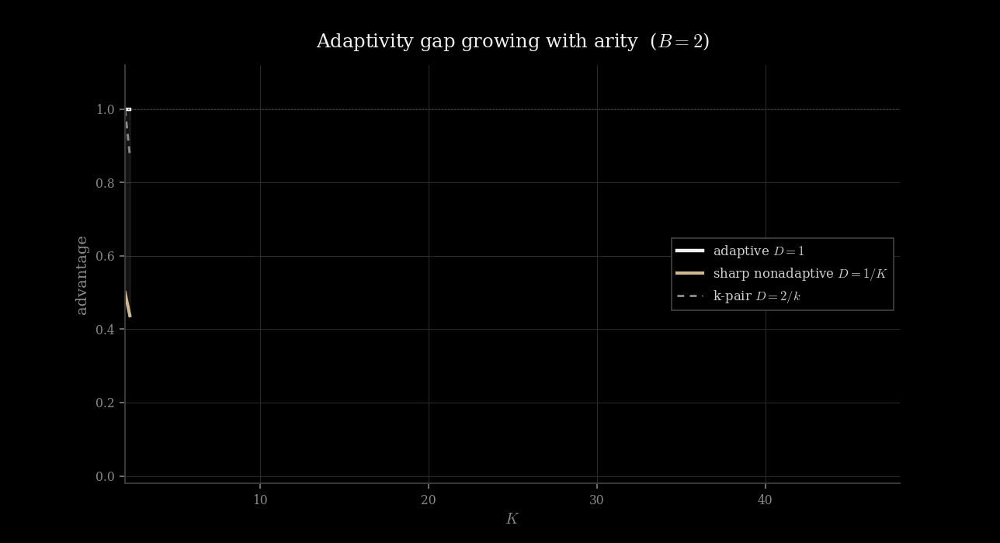
</p>

<p align="center">
  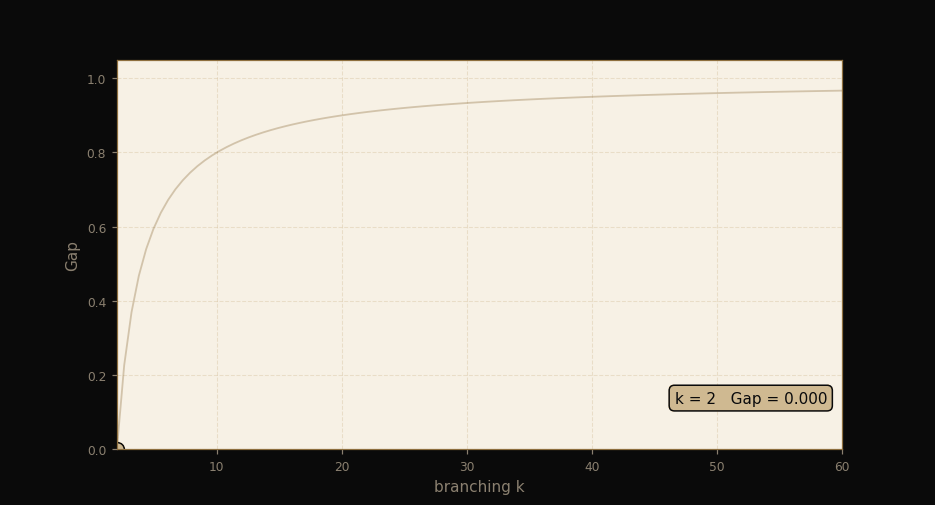
</p>

<p align="center">
  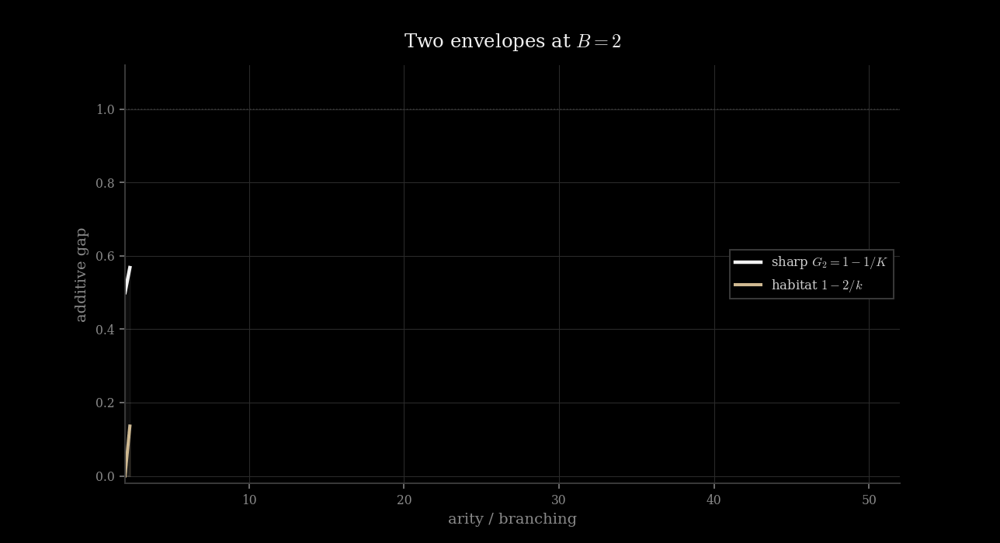
</p>

<p align="center">
  
</p>

<p align="center">
  
</p>

---

## §3. Formal apparatus

$$
\mu:=P-Q,\quad
\sum_{w\in W}\mu(w)=0,\quad
S_\mu=\\{w:\mu(w)\ne0\\},\quad
r=|S_\mu|.
$$

$$
V_\mu(\Pi)=\frac12\sum_{C\in\Pi}|\mu(C)|
=\mathrm{TV}(\mathrm{Law}_P T,\mathrm{Law}_Q T).
$$

Bayes bridge (weighted classification trees):

$$
M(w,0)=\tfrac12 P(w),\\;
M(w,1)=\tfrac12 Q(w),\qquad
V_\mu(\Pi)=1-2R(\Pi),
$$

$$
D_B^{\mathrm{ad}}=1-2R_B^{\mathrm{tree}},\qquad
D_B^{\mathrm{na}}=1-2R_B^{\mathrm{static}}.
$$

Root-arity proof core: $V(\pi)=\sum_{i=1}^k v_i$ and $D_2^{\mathrm{na}}\ge\max_i v_i$, hence

$$
D_2^{\mathrm{ad}}\le K\\,D_2^{\mathrm{na}},\qquad
D_2^{\mathrm{ad}}-D_2^{\mathrm{na}}\le\Bigl(1-\frac1K\Bigr)D_2^{\mathrm{ad}}\le 1-\frac1K.
$$

Matching address family $W_K=\\{(i,x):i\le K,\\;x\in\\{0,1\\}^K\\}$:

$$
P(i,x)=\frac{\mathbf{1}_{x_i=0}}{K\\,2^{K-1}},\quad
Q(i,x)=\frac{\mathbf{1}_{x_i=1}}{K\\,2^{K-1}},\quad
g(i,x)=i,\\; b_j(i,x)=x_j.
$$

Gain-sensitive support bound and open curve:

$$
D_2^{\mathrm{na}}\ge V_0+\max_i g_i,\qquad
m\le\min\Bigl\\{K,\Big\lfloor\tfrac r2\Big\rfloor\Bigr\\},
$$

$$
G_2(K,r)=\sup\bigl\\{D_2^{\mathrm{ad}}-D_2^{\mathrm{na}}:\mathrm{arity}\le K,\\;|S_\mu|\le r\bigr\\}.
$$

Known anchors: $G_2(K,r)=0$ for $r\le 3$; $G_2(2,4)=1/2$; $G_2(K,\infty)=1-1/K$. Exact intermediate surface mostly open.

<p align="center">
  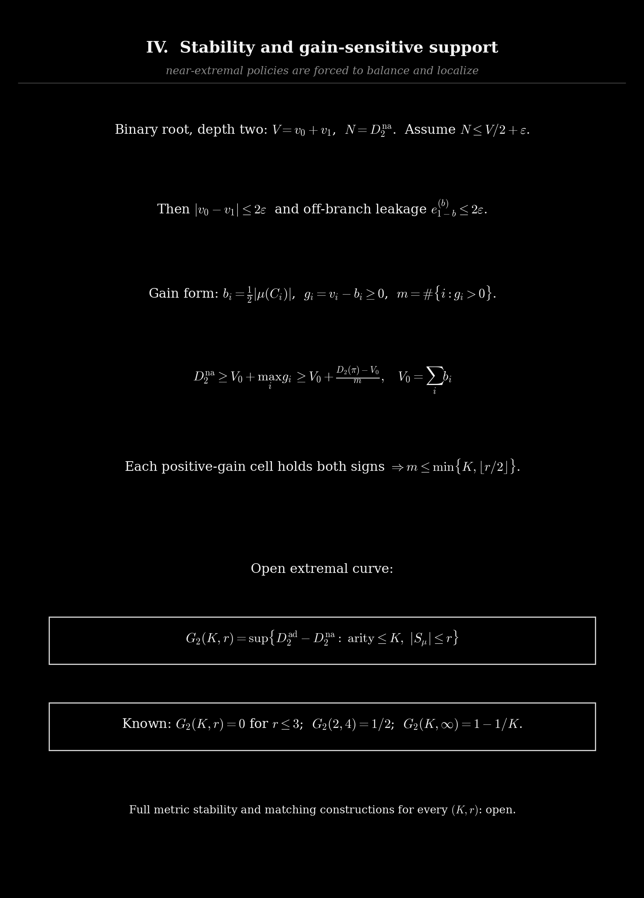
</p>

<p align="center">
  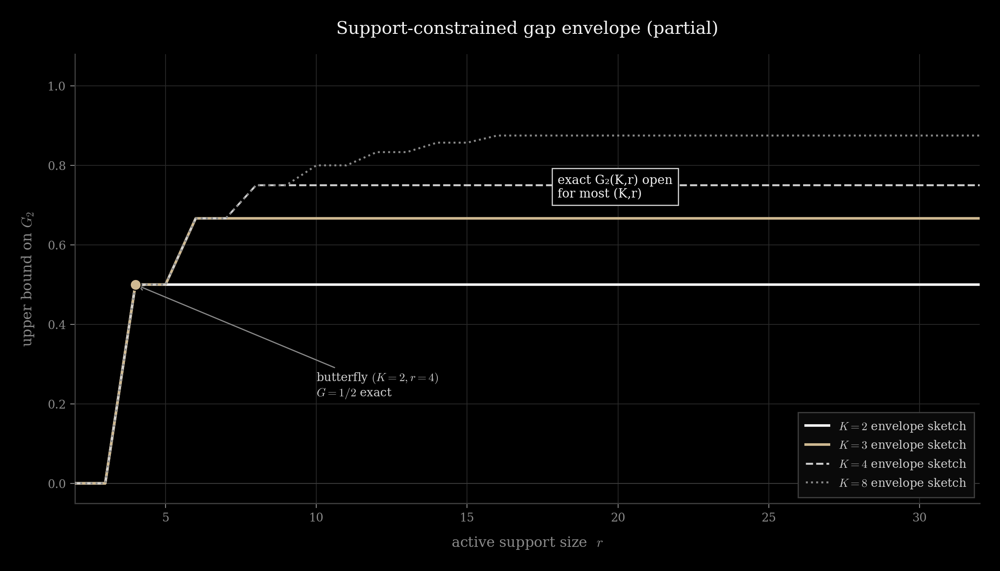
</p>

Full write-up: [`research/THEOREMS.md`](research/THEOREMS.md) · analytic proofs: [`research/m5/SEED_THEOREMS.md`](research/m5/SEED_THEOREMS.md).

---

## §4. Habitat-shaped families

The following closed forms describe filesystem-shaped query geometries. They are applications of the general apparatus, not replacements for the sharp law $G_2(K)$.

**$k$-pair (which-then-bit).** Uniform random branch; payload bit differs under the two hypotheses; off-branch bits return $\mathtt{na}$. Adaptive with budget two achieves TV $=1$; best nonadaptive suite of budget two achieves $2/k$. Gap $1-2/k\to 1$. Myopic “strongest local check first” never opens with the branch query; ratio $k/2\to\infty$.

**All fixed budgets.** On the same family, for every $B\ge 2$:

$$
D_B^{\mathrm{ad}}=1,\qquad D_B^{\mathrm{na}}=\frac{\min(B,k)}{k},\qquad \mathrm{Gap}_B(k)\to 1\ (k\to\infty).
$$

A fixed-size checklist cannot uniformly bound adaptive risk across branching factors.

<p align="center">
  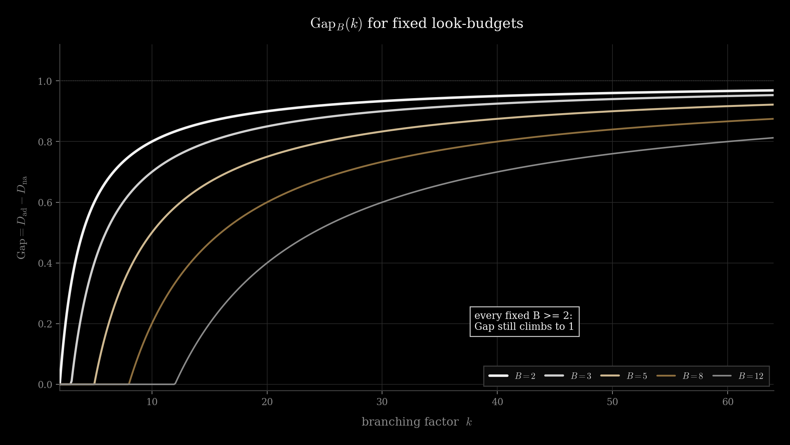
</p>

<p align="center">
  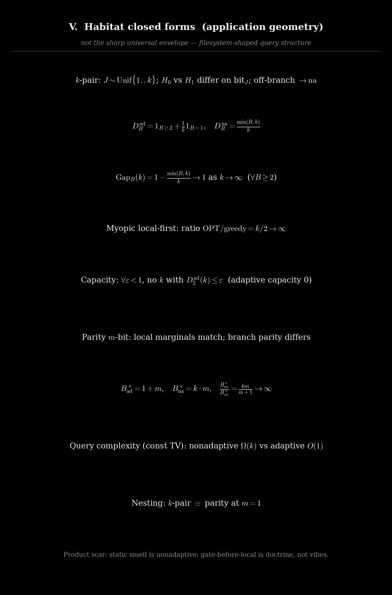
</p>

**Parity payloads.** Local bit marginals matched; global parity differs per branch. Perfect adaptive separation costs $B^\star_{\mathrm{ad}}=1+m$; perfect nonadaptive separation costs $B^\star_{\mathrm{na}}=k\cdot m$. Ratio unbounded in $k$:

$$
\frac{B^\star_{\mathrm{na}}}{B^\star_{\mathrm{ad}}}=\frac{km}{m+1}\to\infty.
$$

<p align="center">
  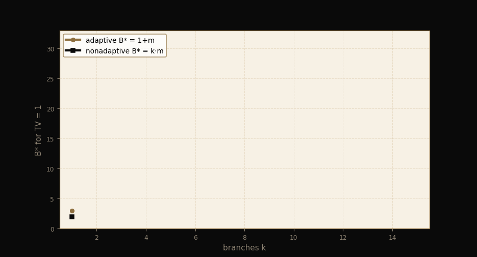
</p>

<p align="center">
  
</p>

**Capacity zero.** Under adaptive inspection with $B\ge 2$ on the $k$-pair family, indistinguishability capacity for any $\varepsilon<1$ is **zero**. Large branching helps checklists; it does not help against which-then-bit.

<p align="center">
  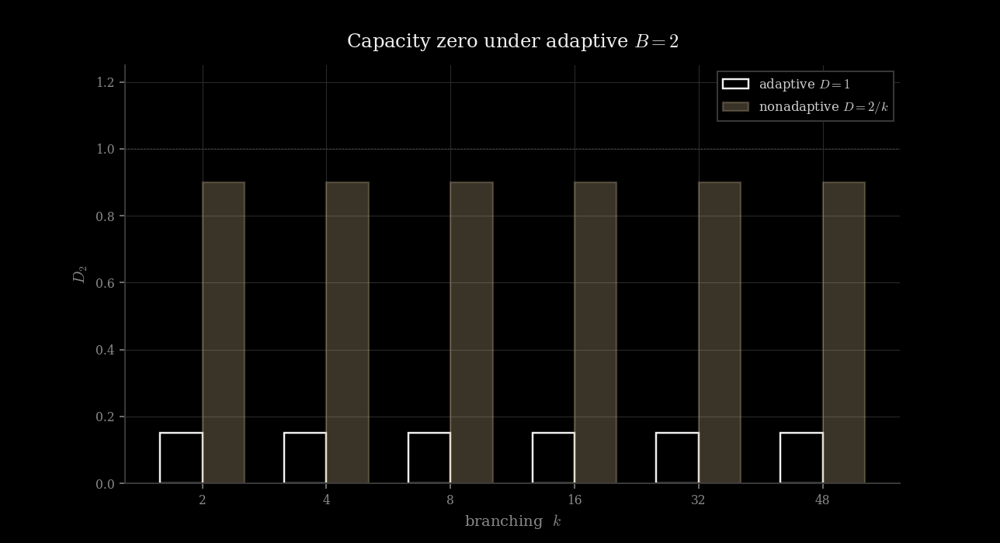
</p>

<p align="center">
  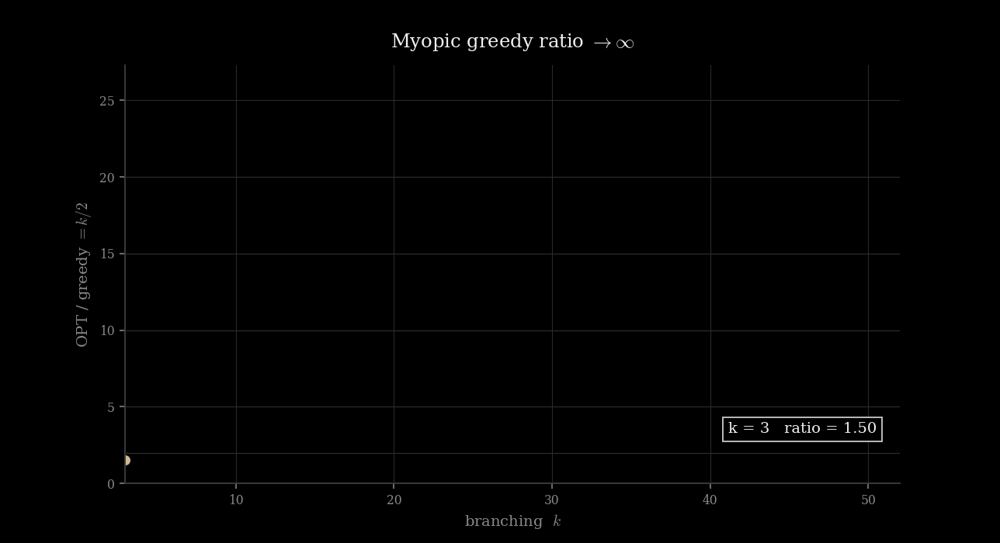
</p>

<p align="center">
  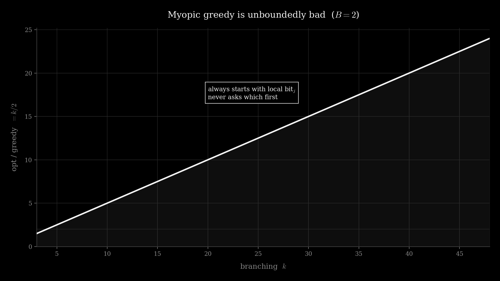
</p>

| Family | Role | Gap / separation |
|--------|------|------------------|
| Address construction (arity $K$) | **Extremal law** | $G_2(K)=1-1/K$ |
| $k$-pair | Habitat + greedy scar | $1-2/k$ at $B=2$ |
| Parity ($m$-bit) | Budget race | $B^\star_{\mathrm{ad}}=1+m$ vs $B^\star_{\mathrm{na}}=km$ |

---

## §5. Certificates and figures

The identities above are accompanied by exact-rational machine checks.

```powershell
pip install -e .
cd research\m5\EXPERIMENTS
python test_m5_exact.py    # G_2(K)=1-1/K, butterfly, support
python test_m5.py          # k-pair closed forms + greedy
cd ..\..\ladder
python run_ladder.py
python run_ladder_high.py
cd ..\m4\EXPERIMENTS
python test_certificates.py
```

On success: for $K=2,\ldots,7$ one has $\mathrm{ad}=1$ and $\mathrm{na}=1/K$; for the $k$-pair family with $k=2,\ldots,12$ one has $\mathrm{na}=2/k$. Figures and animations under `assets/figures/` may be regenerated by `python assets/render_figures.py` and `python assets/render_animations.py`.

---

## §6. Application: habitat cover construction

Encrypted volumes secure the confidentiality of bytes; they do not, by themselves, secure the *narrative* those bytes present on disk. The software layer collected in this repository constructs habitat-shaped cover trees, subjects them to a deterministic detection oracle, and refuses emission when the cover is judged blown. The cipher (Layer 0) is external. Cover construction and the refuse rule are internal.

The design may be read as a load path: construction (`forge`), inspection (`smell`), and a dual refuse gate. Severity aggregation is a monoid on ordinal weights, not a posterior probability of forgery. Laboratory-scale adversaries (T4) are excluded from the sealed claims. Static smell is a nonadaptive checklist: necessary quality control, not a substitute for the adaptive envelopes of §§2–4.

```text
charm doctor
charm bench
charm templates
charm forge -o D:\packs\demo -t photo_library --placeholder -s 1024 --force
charm smell D:\packs\demo -t photo_library
charm explain score_semantics
charm explain adaptive_t1
charm explain gate_before_local
```

<p align="center">
  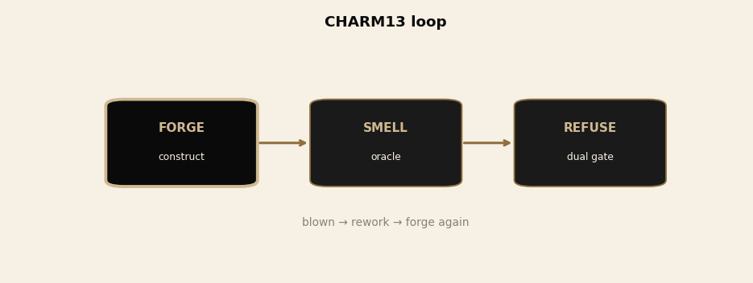
</p>

### Score semantics (binding)

<p align="center">
  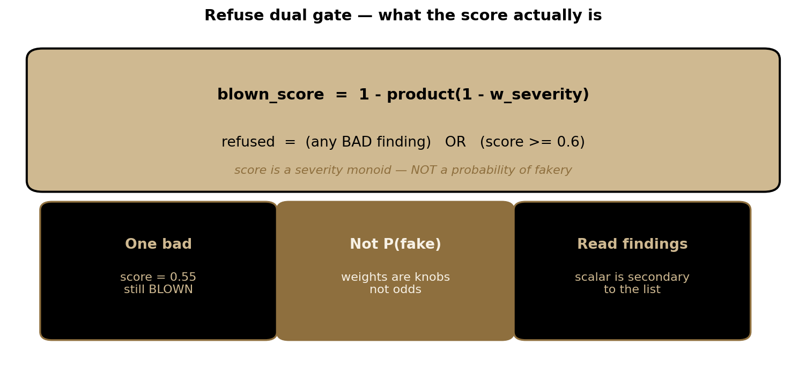
</p>

```text
blown_score = 1 − Π_i (1 − w_sev(i))     # bad=0.55, warn=0.25, info=0.05
refused     = (∃ finding with severity bad)  ∨  (blown_score ≥ 0.6)
```

| Fact | Implication |
|------|-------------|
| Weights are ordinal | Not calibrated likelihoods or posteriors |
| Product is a monoid | Commutative severity aggregation, not $\mathbb{P}(\text{generated})$ |
| Dual gate | One bad finding alone scores 0.55 and still refuses |
| Clean report | Necessary for refuse automation—not a full adaptive T1 bound |

Doctrine: [`docs/T1_BUDGET.md`](docs/T1_BUDGET.md) · naturalness: [`docs/NATURAL.md`](docs/NATURAL.md) · master: [`docs/MASTER.md`](docs/MASTER.md)

---

## §7. Threat model (load cases)

| Case | Adversary | Claim |
|------|-----------|--------|
| **T0** | Glancing human | Strong on implemented tells |
| **T1** | Curious technical peer, short session | Improves cost of casual tells; smell is nonadaptive; see `docs/T1_BUDGET.md` |
| **T2** | Offline stolen disk | Crypto holds if L0 holds; cover may affect prioritization only |
| **T3** | Compelled password | Not claimed until CELLAR is complete |
| **T4** | Laboratory process and time | **No claim.** |

---

## Habitats

| Template | Narrative |
|----------|-----------|
| `adobe_cache` | Media cache debris (default) |
| `steam_depot` | Local depot fragment |
| `vm_disk` | VM metadata + disk-like blob |
| `photo_library` | Managed library store |
| `sql_backup` | Database dump handoff |
| `docker_cache` | Overlay / layer residue |
| `mail_store` | Mailbox export slice |
| `iso_mirror` | Install media fragment |
| `incomplete_download` | Interrupted transfer |
| `wgs_lab` | Optional sequencing pack habitat |
| `generic` | Untyped bulk |

Naturalness is **habitat-relative**. Opaque extensions for non-genuine formats. Specialist names require magic and membership. Famous public sample IDs forbidden as decoration. Published checksums must match bytes.

---

## Commands

| Command | Purpose |
|---------|---------|
| `charm forge` | Build habitat tree + optional volume / placeholder |
| `charm smell` | Findings, severity score, dual refuse |
| `charm bench` | Calibration fixtures (known-bad must blow) |
| `charm explain [code]` | Finding catalog |
| `charm doctor` | Environment + doctrine pointers |
| `charm templates` | List habitats |
| `charm which-vc` | Locate VeraCrypt |

Forge refuses blown covers by default. `--i-know` is an informed override. `--write-seed` is off by default. Size ceilings require `--unsafe-size` when deliberately exceeded.

---

## Research ladder (M4–M18)

| Band | Content |
|------|---------|
| M4 | Finite adaptive gap certificates, score hygiene, witnesses |
| M5 | Flattening, root-arity, $G_2(K)=1-1/K$, butterfly uniqueness, $k$-pair |
| M6–M9 | All-$B$ envelopes, greedy failure, checklist incompleteness, capacity zero |
| M10–M13 | Closed forms vs DP, doctrine pack, parity budgets, unbounded separation |
| M14–M18 | Nesting, score–LR reversals, query complexity, randomized NA, mega-pack |

Reproduce: ladder runners + M4/M5 test suites. Static and animated figures are first-class artifacts of the certificates, not decoration.

**Open frontier.** Support-constrained curve $G_2(K,r)$; equality for $K>2$; sharp $G_B(K)$ for $B\ge 3$; guarded compilation; Lean formalization of the seed package; completed primary-source collision.

---

## Explicit non-goals

- Inventing or “improving” ciphers  
- Probability-of-generation marketing for `blown_score`  
- Operational guidance for concealing material from forensic inspection  
- Exhaustive file-type encyclopedias  
- T4 claims under any packaging  
- Literature-novelty press language for the sharp seed package  

---

## §8. Software layout (abbreviated)

```text
charm
├── forge      construction sequence + refuse joint
├── smell      as-built inspection + severity monoid + dual gate
├── props      habitat members (decoy trees)
├── caliper    size bands / opaque payload policy
├── ecology    specialist families + habitat membership
├── forgery    seeded identity fields
├── kernel     foundation L0 (VeraCrypt create)
├── bench      known-bad load tests
└── catalog    detail catalog (explain surface)
```

Process: [`docs/SKUNKWORKS.md`](docs/SKUNKWORKS.md) · security: [`SECURITY.md`](SECURITY.md) · field notes: [`docs/FIELD_GUIDE.md`](docs/FIELD_GUIDE.md)

---

## Colors

**Purdue black** `#000000` / `#0A0A0A` · **old gold** `#CFB991` · Boiler Up.

## Colophon

**David Lombardo** · MIT License · v0.3.8  
[github.com/coldbricks/charm13](https://github.com/coldbricks/charm13)

All mathematical claims are relative to the finite models named in the text. Open questions are listed in the theorem catalog.
