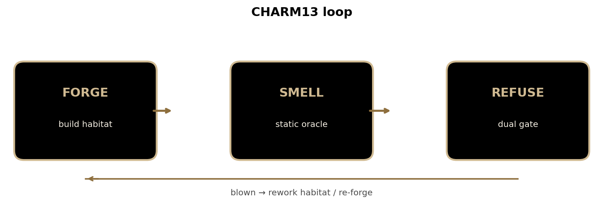
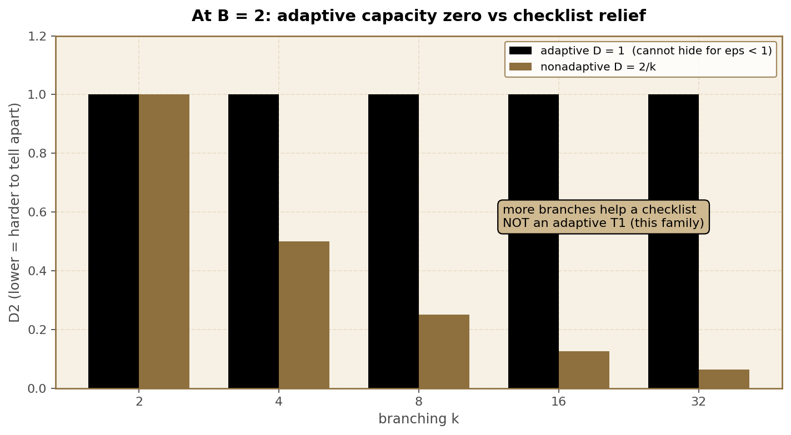
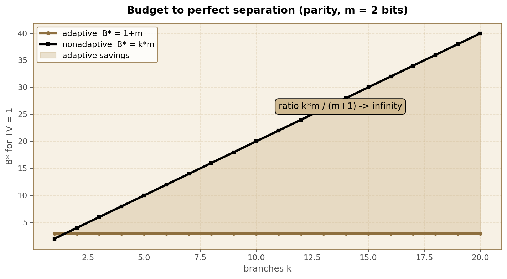

<p align="center">
  
</p>

<p align="center">
  
</p>

# CHARM13

### Wait — what is this.

A **camouflage factory** for encrypted volumes that builds on-disk cover stories…  
then runs a **detector allowed to refuse its own lies**.

Not a new cipher.  
Not “military grade.”  
Not a T4 fantasy.

It is: **construct → smell → refuse if blown**, plus finite-model math that shows a *curious adaptive inspector* can destroy a *fixed checklist* of the same look-budget — **arbitrarily hard**.

```text
pip install -e .
charm doctor
charm bench
charm forge -o D:\packs\demo -t photo_library --placeholder -s 1024 --force
charm smell D:\packs\demo -t photo_library
charm explain score_semantics
charm explain adaptive_t1
```

<p align="center">
  
</p>

---

## The part that makes people go quiet

On an explicit infinite family of synthetic habitats (k branches; ask *which*, then check that branch):

| Quantity | Value |
|----------|------:|
| Adaptive advantage at budget 2 | **1** (perfect) |
| Best checklist of budget 2 | **2/k** |
| Gap as k → ∞ | **→ 1** |
| Myopic “strongest local first” ratio | **k/2 → ∞** |
| Adaptive camouflage capacity for ε &lt; 1 | **0** |

<p align="center">
  
</p>

<p align="center">
  
</p>

<p align="center">
  
</p>

More charts: [assets/figures/](assets/figures/) · regenerate with `python assets/render_figures.py`

---

## Formula pop-outs (operator edition)

| Object | Meaning |
|--------|---------|
| \(D_B^{\mathrm{ad}}\) | Best adaptive distinguishing advantage with look-budget \(B\) (total variation of transcripts) |
| \(D_B^{\mathrm{na}}\) | Best **fixed checklist** of total cost \(B\) |
| \(\mathrm{Gap}_B = D_B^{\mathrm{ad}} - D_B^{\mathrm{na}}\) | How much curiosity beats a script |
| `blown_score` | Severity monoid \(1-\prod(1-w_i)\) — **not** \(P(\text{fake})\) |
| refuse | **any bad** OR score ≥ 0.6 |

<p align="center">
  
</p>

Full operator doctrine: **[docs/T1_BUDGET.md](docs/T1_BUDGET.md)**  
“I don’t know this field” guide: **[docs/FIELD_GUIDE.md](docs/FIELD_GUIDE.md)**  
Where to put a DOI / preprint: **[docs/WHERE_TO_SHARE.md](docs/WHERE_TO_SHARE.md)**

---

## Threat model (honest)

| Tier | Adversary | Claim |
|------|-----------|--------|
| T0 | Glancing human | Strong on implemented tells |
| T1 | Curious tech, short look | Helps; **not** a general adaptive warranty |
| T2 | Stolen disk | Crypto holds |
| T3 | Password demand | Not until CELLAR |
| T4 | Lab + process | **No claim. Ever.** |

---

## Habitats

`adobe_cache` (default) · `steam_depot` · `vm_disk` · `photo_library` ·  
`sql_backup` · `docker_cache` · `mail_store` · `iso_mirror` ·  
`incomplete_download` · `wgs_lab` · `generic`

See [docs/NATURAL.md](docs/NATURAL.md).

---

## Research ladder

Exact-rational certificates M4–M18 under [`research/`](research/LADDER_MASTER.md).

```powershell
cd research\ladder
python run_ladder.py
python run_ladder_high.py
```

<p align="center">
  
</p>

<p align="center">
  
</p>

<p align="center">
  
</p>

**Novelty packaging:** broad adaptivity phenomena are classical  
(`KNOWN RESULT, NEW APPLICATION`). Residual = exact envelopes, assumptions, product scars.

---

## Not this

- New cipher  
- Probability-of-fakery marketing  
- Anti-forensics cookbook  
- T4  

---

## Docs

| Doc | Role |
|-----|------|
| [docs/MASTER.md](docs/MASTER.md) | Doctrine |
| [docs/T1_BUDGET.md](docs/T1_BUDGET.md) | Score + adaptive T1 |
| [docs/FIELD_GUIDE.md](docs/FIELD_GUIDE.md) | What field is this |
| [docs/WHERE_TO_SHARE.md](docs/WHERE_TO_SHARE.md) | Zenodo / arXiv / etc. |
| [research/LADDER_MASTER.md](research/LADDER_MASTER.md) | Math index |
| [SECURITY.md](SECURITY.md) | Security notes |

---

## Colors

**Purdue black** `#000000` · **old gold** `#CFB991` · Boiler Up.

## License

MIT · **v0.3.4**
